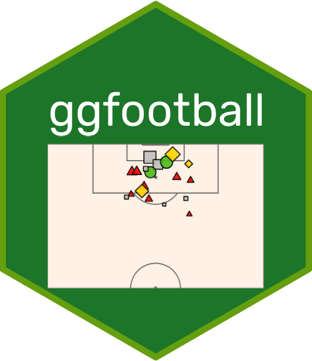

<!-- README.md is generated from README.Rmd. Please edit that file -->

# ggfootball 

*It’s Football not Soccer.*

<!-- badges: start -->

[](https://lifecycle.r-lib.org/articles/stages.html#experimental)
[](https://cran.r-project.org/package=ggfootball)
<!-- badges: end -->

## Overview

The ggfootball package provides R functions that scrape shots data from
[understat](https://understat.com/) and visualizes it using interactive
plots:

- A detailed shot map displaying the location, type, and expected goals
  (xG) value of shots taken by both teams.
- An xG timeline chart showing the cumulative expected goals for each
  team over time, annotated with the details of scored goals.

## Installation

You can install ggfootball from
[CRAN](https://cran.r-project.org/package=ggfootball) with:

``` r
install.packages("ggfootball")
```

## Example

``` r
library(ggfootball)

# xG chart
xg_chart(match_id = 26631, 
         home_team_color = "red", 
         away_team_color = "grey", 
         competition = "Premier League",
         bg_color = "#FFF1E5",
         plot_bg_color = "#FFF1E5")

# Shot/xG map
xg_map(match_id = 26631, title = "xG Map")
```

## Acknowledgements

- [Ewen Henderson](https://ewen.io/) for his amazing
  [{understatr}](https://ewenme.github.io/understatr/) package which I
  used to extract data.

- [Guangchuang YU](https://yulab-smu.top/) for his
  [{hexSticker}](https://github.com/GuangchuangYu/hexSticker) package
  which I used to create the logo for this package.
